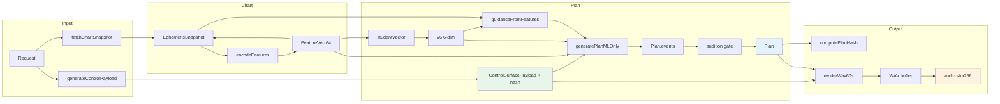
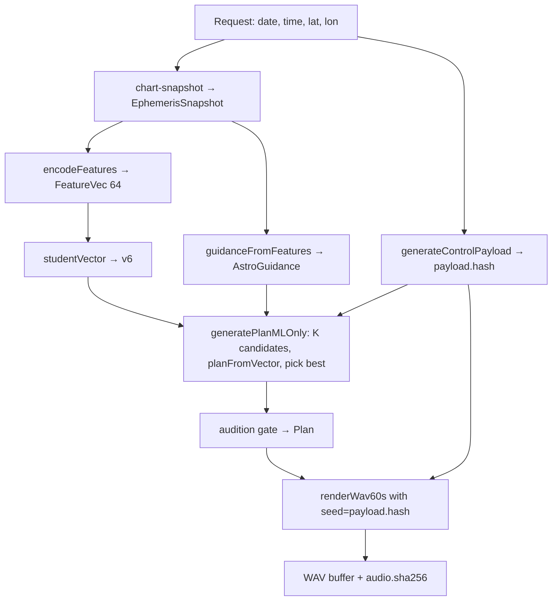

# Audio composition pipeline — one-pager

**Same (chart + controls) ⇒ same Plan ⇒ same WAV sha256.** No randomness in plan or render; all variation from `payload.hash`.

---

## Pipeline diagram

**Simplified chain:** Request → **Snapshot** → **FeatureVec** → **v6** (ML) + **Guidance** → **Plan** (narrative + gates) → **WAV** (renderer, seed = payload.hash).

### Vertical view (top → bottom)

---

## Key files (deterministic on output)

| Step | File | In/out |
|------|------|--------|
| Chart | `server/index.js` (GET /api/chart-snapshot) | date,time,lat,lon → EphemerisSnapshot |
| Features | `vnext/feature-encode.ts` | Snapshot → FeatureVec[64] |
| ML | `vnext/ml/index.ts` | FeatureVec → v6[6] |
| Guidance | `vnext/astro/guidance.ts` | FeatureVec + Snapshot → AstroGuidance |
| Plan | `vnext/plan-generator.ts` | feat + payload → Plan (K candidates, pick best) |
| Notes | `vnext/planner/narrative.ts` | v6 + guidance → Plan.events |
| Gates | `vnext/audition-gate.ts` | Plan → timewarp/trim (optional) |
| WAV | `vnext/audio/wav-renderer.ts` | Plan + payload.hash → 60s PCM, sha256 |

---

## Env that affect output

| Env | Effect |
|-----|--------|
| `VNEXT_HUMANIZE=0` | Renderer: flat envelope (different WAV sha) |
| `VNEXT_K`, `VNEXT_JITTER` | Plan: candidate count and jitter (same seed ⇒ same candidates) |
| `MIN_RULE_QUALITY` | Plan: reject if best candidate below threshold |
| `ENABLE_WAV_EXPORT=1` | Compose: include WAV in response (does not change WAV content) |

---

## Determinism contract

- **Seed:** `payload.hash` = hash of control payload (from `generateHash` in compose.ts).
- **Plan:** Same FeatureVec + same payload.hash ⇒ same v6, same chosen plan, same Plan.events.
- **WAV:** Same Plan + same payload.hash ⇒ same PerformanceParams, same PCM ⇒ same **audio.sha256**.
- No `Math.random` or `Date.now` in plan or WAV path.

*Full audit: `docs/AUDIO-COMPOSITION-PIPELINE-AUDIT.md`*
